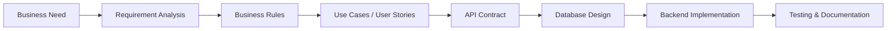

# NicolaiHong

### Technical Business Analyst | Backend-focused System Analyst | Full-stack Developer

I translate business requirements into system models, API contracts, database structures, and maintainable backend solutions. My work connects requirement analysis, workflow design, business rules, database design, and backend implementation so product decisions can move cleanly into engineering execution.

---

## Professional Focus

- Clarifying requirements, business constraints, edge cases, and decision logic before implementation.
- Modeling use cases, workflows, user journeys, status transitions, and process behavior.
- Defining API contracts, request and response structures, validation rules, and backend behavior.
- Designing database structures, relationships, indexes, and SQL-based analysis flows.
- Producing technical documentation that developers can use directly during implementation.
- Supporting backend and full-stack delivery with engineering-level understanding of system behavior.

---

## Technical Stack

### Analysis & Modeling

### Languages

### Backend

### Frontend

### Databases

### Infrastructure & Tools

### Architecture

---

## How I Work

---

## Featured Projects

### Jira-like Microservices System

A project management system focused on workflow management, issue tracking, role-based access control, and service-oriented backend architecture.

**Highlights**

- Requirement analysis for project, sprint, issue, and permission flows.
- Workflow and status transition rules for issue lifecycle control.
- Service boundary design for modular backend responsibilities.
- API contract design for project, issue, user, and role modules.
- PostgreSQL schema design for relational project data.
- Redis caching for frequently accessed workflow and permission data.
- Docker-based local development for service orchestration.

**Tech Stack**

[Repository](https://github.com/NicolaiHong/jira-like-microservices-system)

### 3D Stylist Backend System

A backend system for an AI-powered 3D model generation platform, focusing on user flows, credit-based usage, payment logic, external API integration, and scalable backend behavior.

**Highlights**

- Credit and payment flow analysis across user actions and generation requests.
- Guest vs authenticated user logic for access control and usage limits.
- API integration with external AI generation services.
- Order and generation tracking from request creation to final result.
- Business rule documentation for credits, payments, retries, and failure states.
- Backend service design for predictable generation workflows.

**Tech Stack**

[Repository](https://github.com/NicolaiHong/3d-stylist-backend-system)

### Full-stack Web Application

A full-stack application demonstrating frontend-backend integration, API design, authentication, database modeling, and maintainable system structure.

**Highlights**

- Frontend integration with backend APIs through clear request and response contracts.
- Authentication flow covering user identity, session handling, and protected routes.
- Database modeling for core entities, relationships, and query behavior.
- API documentation for implementation, testing, and future maintenance.
- Clean project structure with separated frontend, backend, and data concerns.

**Tech Stack**

[Repository](https://github.com/NicolaiHong/full-stack-web-application)

---

## Documentation Mindset

My technical documentation usually covers:

- Business context
- Stakeholders and user roles
- Functional requirements
- Non-functional requirements
- Business rules
- Use cases
- User stories
- API contracts
- ERD and database design
- Architecture decisions
- Risks and trade-offs

---

## GitHub Stats

---

## Contact

- Email: [hongkhoa34@gmail.com](mailto:hongkhoa34@gmail.com)
- GitHub: [NicolaiHong](https://github.com/NicolaiHong)
