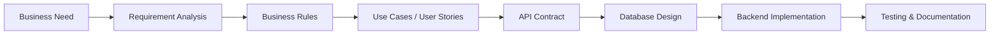

# NicolaiHong

### Technical Business Analyst

I translate business requirements into system models, API contracts, database structures, and maintainable backend solutions. My work connects requirement analysis, workflow design, business rules, database design, and backend implementation so product decisions can move cleanly into engineering execution.

---

## Professional Focus

- Clarifying requirements, business constraints, edge cases, and decision logic before implementation.
- Modeling use cases, workflows, user journeys, status transitions, and process behavior.
- Defining API contracts, request and response structures, validation rules, and backend behavior.
- Designing database structures, relationships, indexes, and SQL-based analysis flows.
- Producing technical documentation that developers can use directly during implementation.
- Managing user stories, acceptance criteria, backlog items, and issue tracking with BA/product tools.
- Validating API behavior and integration flows with focused testing tools.
- Supporting backend and full-stack delivery with engineering-level understanding of system behavior.

---

## Technical Stack

### Analysis & Modeling

### BA & Product Tools

### Testing

### Languages

### Backend

### Frontend

### Databases

### Infrastructure & Tools

### Architecture

---

## How I Work

---

## Documentation Mindset

My technical documentation usually covers:

- Business context
- Stakeholders and user roles
- Functional requirements
- Non-functional requirements
- Business rules
- Use cases
- User stories
- API contracts
- Swagger/OpenAPI documentation
- ERD and database design
- Architecture decisions
- Jira backlog and acceptance criteria
- Postman API validation notes
- Risks and trade-offs

---

## Contact

- Email: [hongkhoa348@gmail.com](mailto:hongkhoa348@gmail.com)
- GitHub: [NicolaiHong](https://github.com/NicolaiHong)
